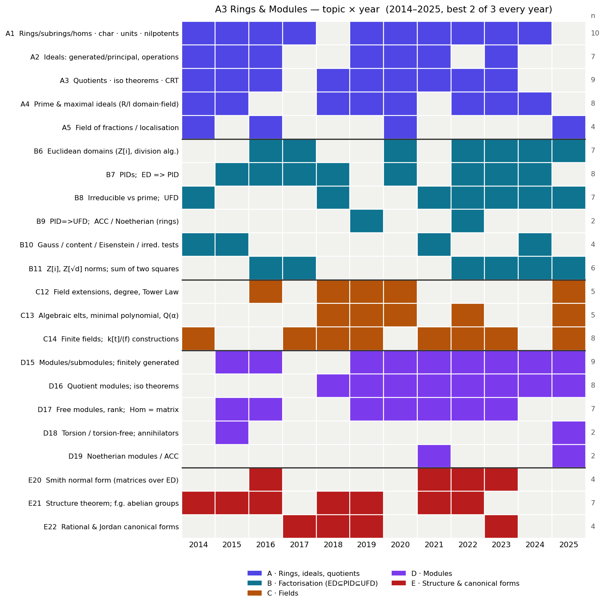

# A3 (Rings and Modules) — past-paper patterns & 2026 predictions

*Built from all 12 papers, 2014–2025 (Oxford Part A, paper A3; titled "Algebra 2" in 2014–15, "Rings and Modules" from 2016). Companion files: `a3_heatmap.png` (topic × year grid), `a3_topic_matrix.csv` (the raw matrix). Cross-checked against the current course notes (`rm.html`).*

---

## 0. TL;DR — what I'd bet on for 2026

1. **The format is rock-stable — bank on it.** Every year 2014–2025: **3 questions, answer the best 2, 25 marks each, 90 minutes, no sections.** Unlike A2 (which was re-balanced in 2025) A3 has *not* changed. The three questions reliably span the syllabus as **{rings + factorisation} · {fields} · {modules + structure}**, so best-2-of-3 means you can sacrifice **one** whole area — but only one.
2. **A modules/structure question appears every single year.** The D/E clusters (modules, isomorphism theorems, structure theorem, canonical forms) are non-negotiable — there has *always* been at least one. Likewise a **Euclidean/PID/UFD** question (B cluster) shows up almost every year.
3. **Z[i] / Z[√d] arithmetic is the rising star.** Norms, units, irreducibility, non-unique factorisation and the **sum-of-two-squares** theorem (p ≡ 1 mod 4) appear in **all four** of 2022, 2023, 2024, 2025 (and 2016–17), after a 2018–21 gap. The 2025 Fermat two-squares set-piece (via Z[i] Euclidean) is worth knowing cold.
4. **Canonical forms are overdue.** The structure theorem / Smith normal form / rational-&-Jordan-form material (E20–E22) was heavy through 2023 but **absent in both 2024 and 2025**. Historically it recurs — a strong asymmetric bet for 2026.

Confidence: **high** on the format and on "a module/structure question + a factorisation question every year" (12/12 each); **medium** on the specific rotation calls (canonical forms returning, fields recurring).

---

## 1. The format (stable — this is the good news)

| Feature | Every year 2014–2025 |
|---|---|
| Questions | **3**, answer **best 2** |
| Marks | 25 each (50 total) |
| Length | 90 minutes |
| Sections | **none** (free choice of any 2 of 3) |
| Title | "Algebra 2" (2014–15) → "Rings and Modules" (2016 →) |

**How the three questions partition the syllabus** (the recurring shape):

- **Q-type α — Rings, ideals & factorisation:** prime/maximal ideals, Euclidean domains, PIDs, UFDs, Gauss/Eisenstein, Z[i]/Z[√d].
- **Q-type β — Fields *or* more factorisation:** field extensions, Tower Law, minimal polynomial, finite fields — *or* a second ring/Euclidean-domain question.
- **Q-type γ — Modules & structure:** module/iso theorems, free/torsion modules, Smith normal form, structure theorem, rational/Jordan canonical forms.

Because you choose **any** 2 of 3, you can drop one cluster — but the three rotate which sub-topics they carry, so **own two clusters cold and keep a third as insurance.** The two safest to own (most reliably present): **B (factorisation, incl. Z[i]/Z[√d])** and **D+E (modules + structure)**.

---

## 2. ⭐ Bookwork ranked by likelihood (the "what to memorise" list)

These are the **state-and-prove / prove-this** results. Ranked by frequency and recency.

### Tier 1 — near-certain, **memorise the proof cold**

| Result | Years asked to *prove*/*state* | Why it's a lock |
|---|---|---|
| **ED ⟹ PID** (every ideal in a Euclidean domain is principal) | 17, 18 (via PID gcd+Bézout), 20, 24 (4×) | The single most reliable A3 bookwork. Know the "least-norm element generates" argument cold; the 2018 variant proves hcf existence + Bézout + "irreducible ⟹ maximal" from it. |
| **Z[i] (and Z[ω]) is a Euclidean domain** | 16, 17, 23, 25 (4×) | Asked to *prove* repeatedly. The rounding/division argument with N(a+bi)=a²+b². Gateway to the sum-of-two-squares question. |
| **I prime ⟺ R/I domain;  I maximal ⟺ R/I field** (and maximal ⟹ prime) | 14, 18, 19, 20, 22, 23 (6×) | Tiny, constantly reused, opens many questions. |
| **Structure theorem (statement) ⟹ classification of f.g. abelian groups** | 14, 15, 16, 18 (+ applied 21) | State it correctly (invariant-factor form) and *use* it to count/classify groups of a given order — asked almost every early year and underpins the γ-question. |

A **modules/structure question is guaranteed** (12/12 years), so at least one Tier-1/Tier-2 result from clusters D/E will be needed every time.

### Tier 2 — high; **know the proof, expect it in some year**

| Result | Years | Note |
|---|---|---|
| **First isomorphism theorem for modules** (+ submodule correspondence) | 19, 24 | ker/im are submodules, M/ker ≅ im; the 2024 paper bundled it with the lattice correspondence and Schur's lemma. |
| **Minimal-polynomial package** (m_α irreducible; F[α] ≅ F[x]/⟨m_α⟩ is a field; [F(α):F]=deg m_α) | 19, 22, 25 | The backbone of the fields question; 2025 used it to prove the algebraic numbers form a field. |
| **Tower Law** [L:F]=[L:K][K:F] | 20, 25 | Short, proved outright in both; pairs with the minimal-polynomial package. |
| **Gauss's lemma / content / Eisenstein's criterion** | 14, 15, 21, 24 | Content multiplicativity + Eisenstein (often via x ↦ 1+x on the cyclotomic). |
| **prime ⟹ irreducible; converse in a UFD** | 22, 25 | The one-line proof + the UFD converse. |
| **Smith normal form** (diagonalisation over a ED + uniqueness up to units) | 16, 21, 22, 23 | Both the existence algorithm and the uniqueness statement have been asked. |
| **Rational/Jordan canonical form & "M_A ≅ M_B ⟺ A,B similar"** | 17, 18, 19, 23 | The k[x]-module view of a linear operator; cyclic-vector ⟹ min = char poly. |
| **Chinese Remainder Theorem** (state & prove) | 18 (+ applied 20, 21) | Comaximal ideals; reused to split rings/groups. |

### Tier 3 — moderate; understand it, lighter memorisation

- **f.g. closure lemmas** (submodule/quotient of f.g. is f.g.; "every submodule f.g. ⟹ ACC/Noetherian") — 21, 25.
- **torsion-free f.g. module over a PID ⟹ free** — 15.
- **char(R) is 0 or prime** (for a domain) — 17, 20, 22.
- **Finite-field constructions & "U(F) cyclic" for a finite field** — applied 18, 19, 21, 22, 23, 25.

### Tier 4 — low priority / situational

- Bespoke one-off framings: "associator rings" (15), invariant-bound failure / **M_n(F) has no invariant basis number** (22), Eisenstein-integer norm form a²−ab+b² (17). Understand the ideas; don't over-rehearse the exact bespoke wording.

---

## 3. The guaranteed *computations* — drill these

Every paper has compute parts. The recurring computation *types* (drill the toolkit, not specific answers):

| Computation | Years | Typical task |
|---|---|---|
| **Classify / count f.g. abelian groups** of order n (invariant-factor ⇄ primary) | 14, 16, 18 | Z/60 ⊕ Z/21 canonical form; #groups of order 675 / 216 |
| **Z[i] / Z[√d] arithmetic** (units via N=1, irreducibility, non-unique factorisation, p = u²+v²) | 16, 17, 22, 23, 24, 25 | units of Z[√−d]; 4 = 2·2 = (1+√−3)(1−√−3); p ≡ 1 mod 4 ⟹ sum of two squares |
| **Polynomial irreducibility / factorisation** in Q[x], Z[x] | 14, 21, 24 | Eisenstein, reduction mod p, rational-root; 6x⁴+5x²+1; cyclotomic |
| **Smith normal form / adapted basis** of a submodule | 16 (+ 21, 22, 23) | basis of N ⊆ Z³; invariant factors of a presented group |
| **Rational canonical form** of a given matrix / k[x]-module decomposition | 17, 19, 23 | RCF of a 4×4; decompose Fⁿ as F[x]/⟨…⟩ ⊕ … ; min/char poly |
| **Field degree** [Q(α):Q] / structure of Q(α) | 16, 18, 19, 25 | degrees, Q[√a]=Q[√b]?, Q[A] ≅ Q[√2] |

**Prediction:** at least one **Z[i]/Z[√d]** computation (momentum: all of 2022–25) and at least one **module/structure** computation. Keep the **sum-of-two-squares via Z[i]** argument and the **Smith-normal-form algorithm** ready to reproduce end-to-end.

---

## 4. Trends & rotation (where the asymmetric bets are)

- **Rising — Z[i]/Z[√d]/sum-of-two-squares (B11):** present in **all of 2022, 2023, 2024, 2025** (and 2016–17), absent 2018–21. Clear upward momentum; the Fermat two-squares set-piece is freshly examined (2025) and very learnable.
- **Now a fixture — module foundations (D15/D16):** quotient modules + isomorphism theorems appear **every year from 2018 onward**. Treat module iso/correspondence theory as guaranteed.
- **Overdue — canonical forms & structure (E20–E22):** heavy through 2023 (Smith form, RCF, similarity), then **absent in both 2024 and 2025**. Two-year gap on a historically frequent area → strong candidate to return in 2026. If you want one high-payoff bet, prepare the **structure theorem + Smith-normal-form computation** and **rational/Jordan canonical forms**.
- **Rotating — fields (C12–C14):** dominant in 2019, 2020, 2025; **absent in 2024**. Don't drop it, but it's the most "skippable" of the three clusters in any single year.
- **Steady — Euclidean/PID/UFD (B6–B8):** somewhere in almost every paper; the backbone of the α-question.

---

## 5. How to spend revision time (given the above)

- **Own two clusters cold, keep a third as backup.** Safest pair: **B (Euclidean/PID/UFD + Z[i]/Z[√d])** and **D+E (modules + structure/canonical forms)** — each is present essentially every year. Use **C (fields)** as the insurance third (great when it lands, e.g. 2025).
- **Memorise cold (Tier 1):** ED ⟹ PID; Z[i] is Euclidean; prime/maximal ⟺ R/I domain/field; the structure theorem statement + abelian-group classification; first isomorphism theorem for modules.
- **Drill, don't memorise (the compute toolkit):** abelian-group classification, Smith normal form, polynomial irreducibility (Eisenstein/mod-p/rational-root), Z[√d] arithmetic, rational canonical form.
- **Know-the-statement, lighter on the proof:** PID ⟹ UFD via ACC, Gauss's lemma (know it, can quote), the more bespoke one-offs (associator rings, IBN failure).
- **Two concrete 2026 bets:** (i) a **Z[i]/sum-of-two-squares** part (four years running) and (ii) a **structure-theorem / canonical-forms** question (absent two years, historically frequent). Prepare both end-to-end.

*Caveat: predictions are pattern-extrapolation from 12 papers plus the current notes. The **format** call is as safe as it gets (no change in 12 years); the **topic-rotation** calls (canonical forms returning, fields recurring) are softer single-to-few-year signals — sanity-check against your problem sheets and any lecturer guidance.*
