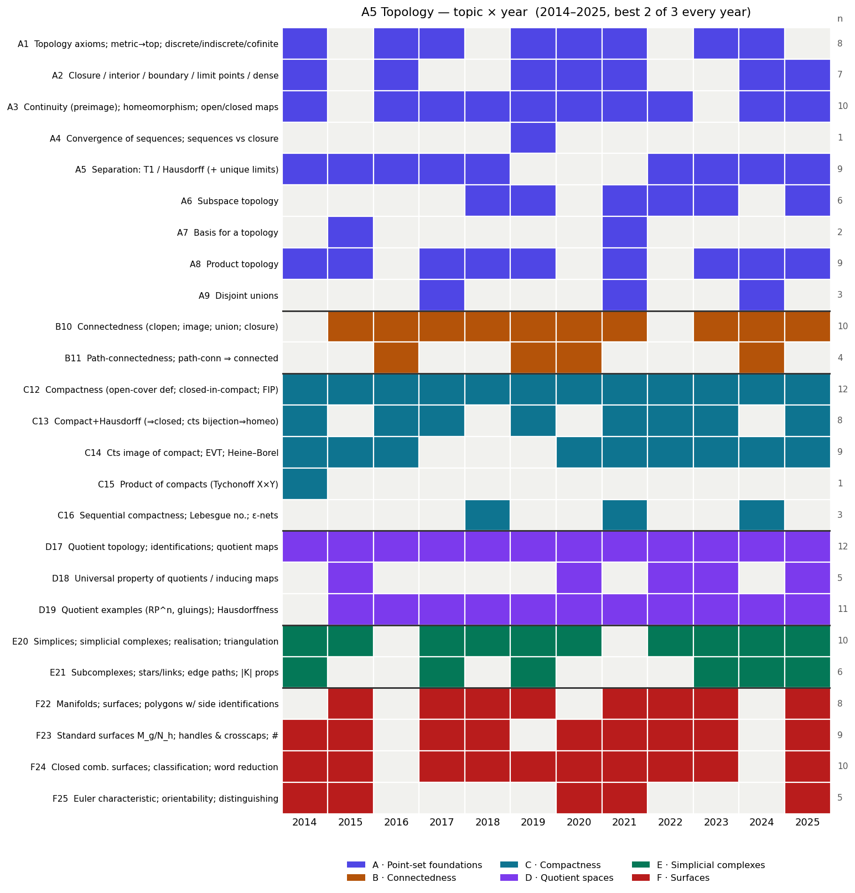

# A5 (Topology) — past-paper patterns & 2026 predictions

*Built from all 12 papers, 2014–2025 (Oxford Part A, paper A5). Companion files: `a5_heatmap.png` (topic × year grid), `a5_topic_matrix.csv` (the raw matrix). Cross-checked against the current course notes (`tp.html`).*

---

## 0. TL;DR — what I'd bet on for 2026

1. **Format is rock-stable.** Every year 2014–2025: **3 questions, answer the best 2, 25 marks each, no sections.** No regime change. The three questions reliably split as **Q1 point-set / connectedness / products**, **Q2 compactness + quotients**, **Q3 the geometric question (simplicial complexes and/or surfaces)** — so best-2-of-3 lets you drop at most one strand.
2. **Quotient spaces and compactness are guaranteed.** Quotient topology / identifications appear in **all 12 years**; compactness in **all 12**. These two are non-negotiable. The single most-tested *skill* is **identifying a quotient space** ("which surface is this? is it Hausdorff?") — every year.
3. **The surfaces question rotates with simplicial complexes.** Surface classification appeared in **10/12** years; the only years without surfaces were **2016** (Q3 was quotients) and **2024** (Q3 was simplicial-complex links). After 2024 skipped surfaces, a **classification / boundary-word-reduction** question is a strong 2026 bet.
4. **Reliable bookwork to prove:** *cts image of compact is compact / EVT*, *compact ⊆ Hausdorff ⇒ closed*, *the quotient topology is a topology + its universal property*, *path-connected ⇒ connected*, and the *statement* of the classification theorem + *definition* of an abstract simplicial complex and its realisation.

Confidence: **high** on the format and on "a quotient question + a compactness result every year" (12/12 each); **medium** on the E-vs-F rotation in Q3 (surfaces vs simplicial complexes).

---

## 1. The format (stable — bank on it)

| Feature | Every year 2014–2025 |
|---|---|
| Questions | **3**, answer **best 2** |
| Marks | 25 each (50 total) |
| Length | 90 minutes (2 hours in 2020, COVID) |
| Sections | **none** |

**The reliable shape of the three questions:**

- **Q1 — point-set / connectedness:** connectedness (clopen / cts-to-$\{0,1\}$), continuity &amp; homeomorphism, products, separation axioms, sometimes a "point-set zoo" (cofinite, lower-limit topology). Often paired with a compactness part.
- **Q2 — compactness + quotients:** compact / sequentially compact, compact⊆Hausdorff⇒closed, EVT, **plus** the quotient topology, quotient maps and an identification.
- **Q3 — the geometric question:** abstract simplicial complexes &amp; realisations, *and/or* surfaces (polygons, words, the classification theorem, Euler characteristic).

Because you choose **any** 2 of 3, own two strands cold and keep a third as insurance. The two safest to own: **compactness + quotients (Q2)** and **the geometric question (Q3)** — each present essentially every year.

---

## 2. ⭐ Bookwork ranked by likelihood (the "what to memorise" list)

### Tier 1 — near-certain, **memorise the proof cold**

| Result | Years proved/asked | Why it's a lock |
|---|---|---|
| **Cts image of compact is compact; Extreme Value Theorem** | 15, 16, 19, 20, 23, 24 (6×) | The compactness workhorse; the EVT corollary recurs. Short, always available. |
| **Compact ⊆ Hausdorff ⇒ closed** (+ separate a point from a compact set) | 16, 17, 23 (+ used in the homeo criterion 17, 21, 22, 25) | The other half of the compactness core; underlies "cts bijection compact→Hausdorff is a homeo." |
| **Quotient topology is a topology; collapsing map cts; universal property** ($g$ cts $\iff g\circ p$ cts) | 15, 19, 20, 22, 23, 25 | Quotients appear every year — this is the bookwork that opens the Q2 quotient half. |
| **Path-connected ⇒ connected** (and cts image of connected is connected) | 15, 16, 19, 20, 24 | Tiny proofs via the cts-to-$\{0,1\}$ criterion; one almost always appears in Q1. |
| **Statement of the classification theorem** + **definition of abstract simplicial complex &amp; realisation** | Q3a, nearly every year | Pure recall marks you cannot afford to drop; state them verbatim. |

### Tier 2 — high; **know the proof, expect it in some year**

| Result | Years | Note |
|---|---|---|
| **Compact + Hausdorff: cts bijection ⇒ homeomorphism** (2.25) | 17, 22, 25 | The tool for identifying quotients and for $|K|$ Hausdorff. Closed-map proof. |
| **$\lvert K\rvert$ of a finite complex is compact, Hausdorff, metrizable** | 19, 25 | Via cts injection into $\mathbb R^N$ + the homeo criterion. |
| **Product topology: Hausdorff/connected preserved; universal property** | 14, 15, 17, 18, 19, 25 | "$X\times Y$ Hausdorff iff both"; "$(f,g)$ cts iff components cts." |
| **Sequential compactness; compact metric ⇒ seq compact; Lebesgue number / ε-nets** | 18, 21, 24 | The metric-compactness package; the Lebesgue-number argument is a favourite. |
| **Boundary-word reduction** to standard $M_g$/$N_h$ form | most surfaces years | Not "bookwork" but a guaranteed computation — drill the moves (see §3). |
| **Tychonoff $X\times Y$ / general Heine–Borel** | 14 (+ underlies Q1/Q2) | Tube-lemma proof; closed+bounded ⇒ compact in $\mathbb R^n$ only. |

### Tier 3 — moderate; understand it, lighter memorisation

- **Connectedness lemmas** (union with common point; closure of connected; connected components) — recurring as parts (15, 16, 18, 21).
- **Closure / interior / boundary / limit points** — appear as computational sub-parts (14, 16, 19, 20, 21, 24, 25), especially in the cofinite / lower-limit "zoo."
- **Basis for a topology** (15, 21) — the lower-limit topology $\mathbb R_{[a,b)}$ is the standard vehicle.
- **$\mathbb{RP}^2$ constructions / models** (15, 21) and **Hausdorffness-of-quotients criterion** (saturated sets) — 2024, 2025 leaned on these.

### Tier 4 — low priority / situational

- **One-point compactification** (2018) and **local compactness** (2022) — appeared as bolt-on parts, slightly beyond the core notes. Glance at them; don't over-invest.
- Exotic point-set zoos beyond cofinite/lower-limit.

---

## 3. The guaranteed *constructions/computations* — drill these

Every paper has at least one. The recurring types:

| Task | Years | Method |
|---|---|---|
| **Identify a quotient / gluing space** ("which surface? is it Hausdorff?") | every year | universal property (3.9) + compact→Hausdorff homeo (2.25); for Hausdorffness use the saturated-set criterion (3.21) |
| **Surface from a polygon word → $M_g$ or $N_h$** | 14, 15, 17, 18, 20, 21, 23, 25 | boundary-word moves: cancel $xx^{-1}$; collect crosscaps $xAxB\!\mapsto\!xxA^{-1}B$; collect handles; handle+crosscap = 3 crosscaps |
| **Compute / use Euler characteristic** to identify or distinguish a surface | 14, 15, 20, 21, 25 | $\chi=V-E+F$; $\chi(M_g)=2-2g$, $\chi(N_h)=2-h$; pair with orientability |
| **"Is this space compact / connected / Hausdorff?"** zoo | 16, 17, 19, 21, 22 | cofinite, lower-limit $\mathbb R_{[a,b)}$, products, indiscrete — test each property from the definition |
| **Build/recognise a simplicial complex** with given realisation; links &amp; stars | 14, 19, 20, 22, 24 | star is open; link of a surface vertex is a circle; $\lvert K\rvert$ compact iff finite |
| **Homeomorphic-or-not** of explicit subspaces (e.g. of $[0,1]^2$, $\mathbb D^2$) | 14, 22, 23 | compactness / connectedness / cut-point invariants; local compactness (2022) |

**Prediction:** at least one **quotient-identification** part and one **surface/word-reduction** part. Have the boundary-word toolkit and the "$\chi$ + orientability ⇒ which surface" routine ready to run end-to-end.

---

## 4. Trends & rotation (where the asymmetric bets are)

- **Q3 rotates E ↔ F.** Surfaces (classification, words, $\chi$) carried Q3 in 14,15,17,18,20,21,23,25; **simplicial complexes** carried it in 2024 (links, subcomplexes — no surfaces) and 2019 leaned simplicial; **2016 had neither** (Q3 was quotients). After 2024's simplicial-only Q3, **surfaces are due** in 2026.
- **Recent papers are more point-set / proof-heavy.** 2024–25 emphasised saturated sets, closed maps, links, and metric-compactness (Lebesgue/$d(a,F)$) over pure recall. Expect rigour, not just definitions.
- **Quotients keep widening.** Beyond standard gluings: $\mathbb R/\mathbb Q$ indiscrete, Hawaiian earring (2021), $S^2$-quotients (2022), Hausdorffness-via-saturated-sets and closed-map criteria (2024, 2025). Know *why* a quotient is/ isn't Hausdorff.
- **Off-core bolt-ons** (one-point compactification 2018, local compactness 2022) appear occasionally — low frequency, modest payoff.

---

## 5. How to spend revision time (given the above)

- **Own two strands cold, keep a third as backup.** Safest pair: **compactness + quotients (Q2)** and **the geometric Q3** (have *both* simplicial complexes and surfaces ready, since Q3 rotates). Use **connectedness/point-set (Q1)** as the insurance third.
- **Memorise cold (Tier 1):** cts image of compact / EVT; compact⊆Hausdorff⇒closed; the quotient topology + universal property; path-conn⇒conn; the classification-theorem statement + simplicial-complex definitions.
- **Drill, don't memorise (the construction toolkit):** quotient identification (via 2.25), boundary-word reduction to $M_g/N_h$, Euler-characteristic + orientability, the compact/connected/Hausdorff "zoo," links &amp; stars.
- **Two concrete 2026 bets:** (i) a **quotient-identification** question (every year) and (ii) a **surfaces / classification** question (overdue after 2024). Prepare both end-to-end.

*Caveat: predictions are pattern-extrapolation from 12 papers plus the current notes. The **format** call is as safe as it gets (no change in 12 years); the **Q3 rotation** (surfaces returning in 2026) is a softer, few-year signal — sanity-check against your problem sheets and lecturer guidance.*
